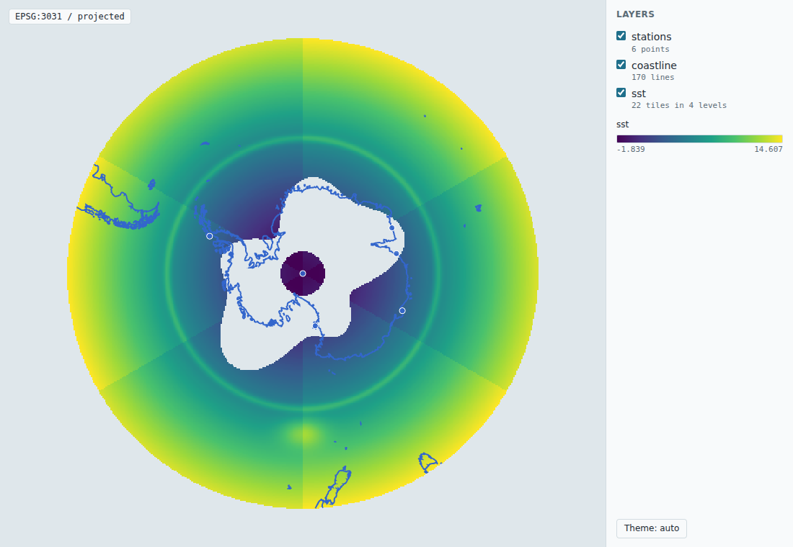
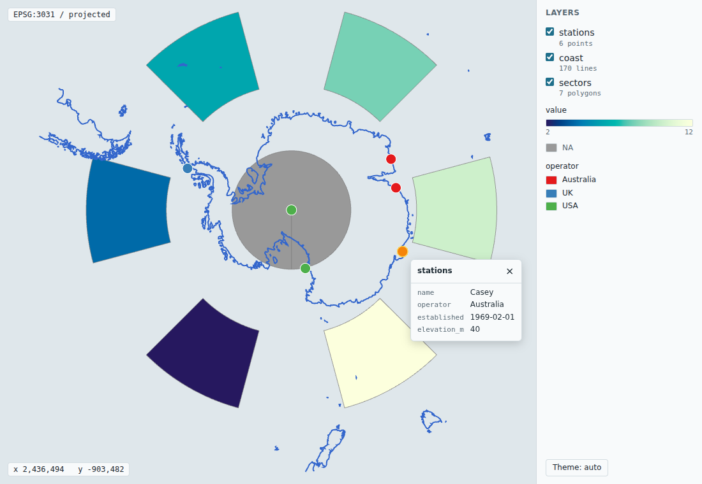
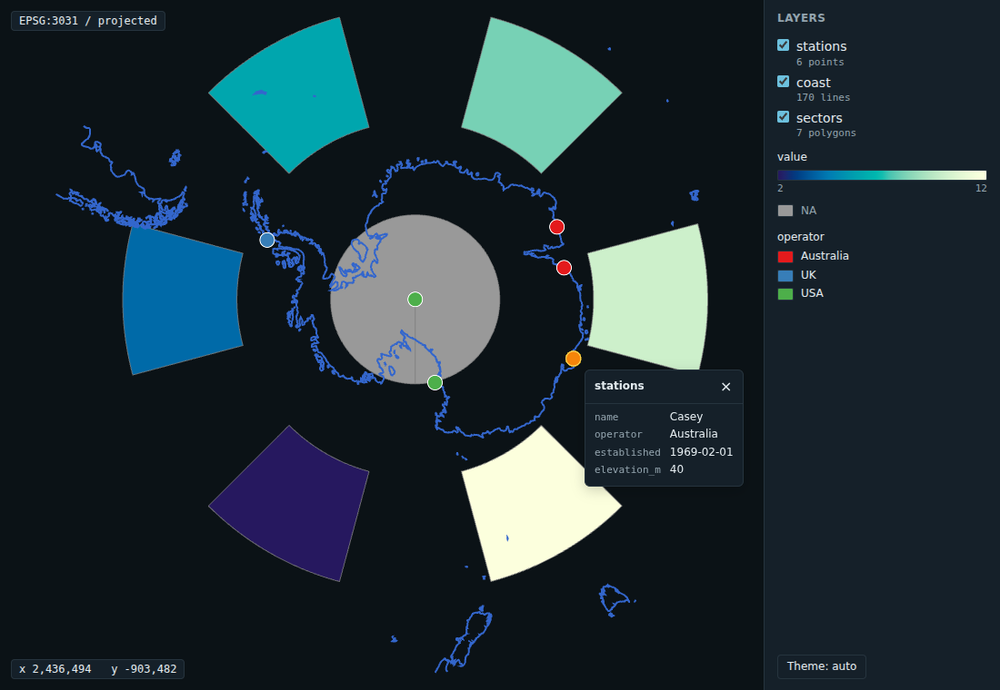
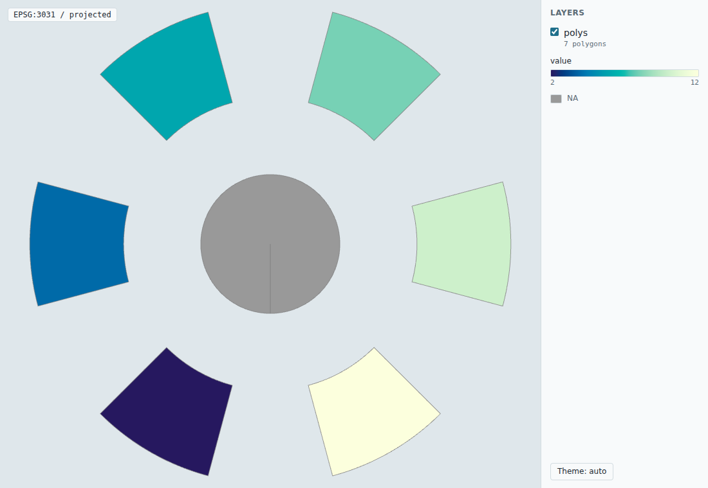
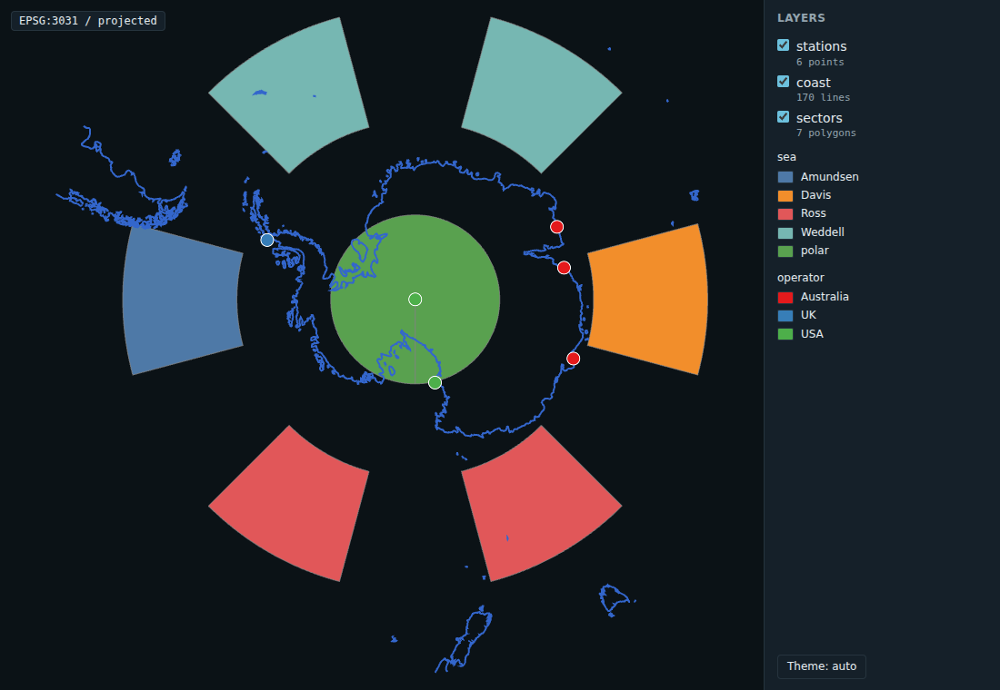
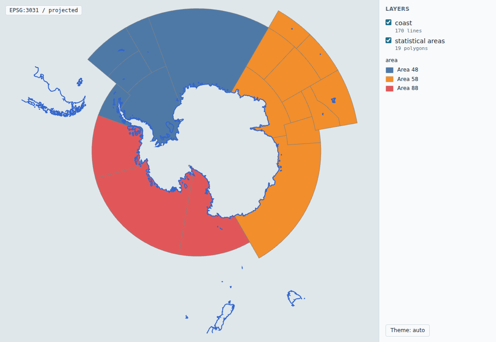
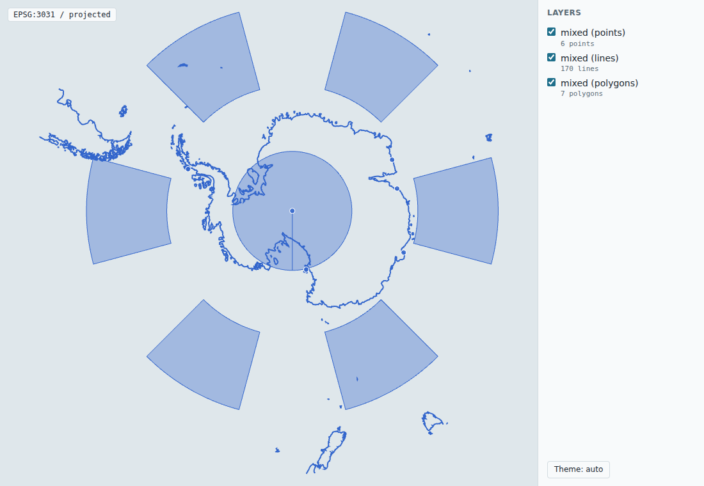
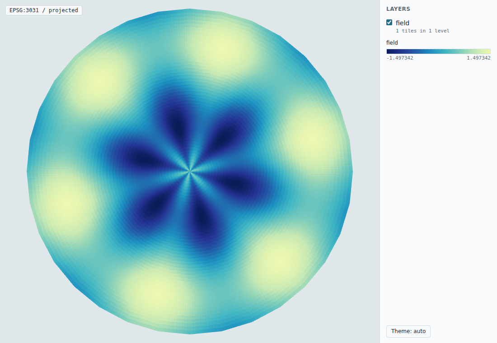

# aobview

Convenience front end for allonboard: a mapview-style `view(x)` for sf and terra, with palettes, legends and popups. The package name is a placeholder.

Read the org agent brief first: [allboa/design AGENTS.md](https://github.com/allboa/design/blob/main/AGENTS.md). It covers the design principles, how work flows, and when to stop and ask.

## Status

Early (phase 3). `view()` draws sf and sfc points, lines and polygons, and terra rasters and vectors, in their own CRS, or in a polar view chosen for them, in a self-contained HTML page written by [aobcore](https://github.com/allboa/aobcore). Several objects draw in one view, as a list or by adding to a view, vector features can be coloured by an attribute, with a legend, and selecting a feature shows its attributes in a popup.

```r
library(aobview)
coast <- sf::st_read(system.file("extdata", "coastline_south_40s.geojson", package = "aobcore"), quiet = TRUE)
view(coast)                       # lon/lat south of 40S: drawn in EPSG:3031
view(coast, crs = "+proj=laea +lat_0=-90 +lon_0=140 +datum=WGS84")

nc <- sf::st_read(system.file("shape", "nc.shp", package = "sf"), quiet = TRUE)
v <- view(nc)                     # lon/lat elsewhere: drawn flat in its own CRS
v$file                            # the page; printing v opens it
```

```r
r <- terra::rast(system.file("extdata", "polar_lonlat.tif", package = "aobcore"))
view(r, palette = "ocean")        # lon/lat raster over the pole: drawn in EPSG:3031
u <- terra::rast("/vsicurl/https://example.org/some.tif")
view(u)                           # a remote COG: the page references it by URL
```

`view()` returns a view with the `scene` and the `file` it wrote. Printing it in an interactive session opens the page in the IDE's viewer or the browser. The page needs no server, and no network unless it references a remote COG.

### Several layers

The v1 target, a polar COG with vector overlays in EPSG:3031, in one call:

```r
sst <- terra::rast(system.file("extdata", "polar_3031.tif", package = "aobcore"))
view(list(sst = sst, coastline = coast))   # one scene in EPSG:3031, sst at the bottom
view(sst) |> view_add(coast, stroke = c(40, 40, 40, 255))   # the same view CRS, with a style
```

A list draws in list order, first at the bottom; its names become layer labels and (made valid and unique) layer ids. The view CRS is `crs =`, or the first projected CRS in the list, or, when everything is in lon/lat, the rule below applied to the combined extent. `view_add()` keeps the view's CRS, so it gives the same scene as the list only when the first object's view CRS is the list's (for example, a projected first object); it warns when that puts projected vectors into a geographic view. Every object is reprojected to it: vectors in R, rasters through aobcore's tile planner. The initial view is the layers' combined extent, clipped to the view's domain.



### Colour by attribute

`zcol` names a column whose values colour each feature: the fill of polygons and points, the stroke of lines. Numbers take a continuous palette over their range (or classes with `breaks =`); factor, character and logical columns take one colour per level. `NA` takes `na_colour`. `palette` is a name from `grDevices::hcl.pals()` or `grDevices::palette.pals()`, or a function of `n` such as `hcl.colors`.

```r
view(nc, zcol = "BIR74", palette = "YlOrRd")
view(nc, zcol = "SID74", breaks = c(0, 5, 10, 20, 50))
view(coast) |> view_add(stations, zcol = "operator", palette = "Set 1")
```

Colours are computed in R by `view_colours()`, which returns the RGBA matrix, and travel to the page as one per-feature RGBA column beside the geometry.

### Legends and popups

With `zcol`, the page shows a legend built from the same `view_colours()` result as the features: a ramp over the range, one entry per interval with `breaks`, or one per level (none above 30 levels), and an `NA` entry only when some value is missing. `legend = FALSE` leaves it out. A palette raster is keyed by a ramp of its palette.

Selecting a feature (a click, tap or key press) shows its attributes. `popup = TRUE` (the default) carries the first 20 attribute columns in the page, `popup = c("name", "depth")` chooses columns, and `popup = FALSE` carries none. Factors travel as their labels and dates and times as ISO 8601 text; list columns are left out with a message.

```r
view(coast, popup = FALSE) |>
  view_add(stations, zcol = "operator", palette = "Set 1")
```

Legends and popups are scene spec 0.5 data ([aobcore](https://github.com/allboa/aobcore) `scene_add_legend()` and `popup =`). A view with neither is written at the lower version it needs, as before.









The package ships a small copy of the CCAMLR statistical areas (Areas 48, 58 and 88) in EPSG:6932, NSIDC EASE-Grid 2.0 South, simplified at 2 km and illustrative only (see `inst/extdata/README`). Coloured by area, with popups, in EPSG:3031 over the coastline:

```r
areas <- sf::st_read(system.file("extdata", "ccamlr_statistical_areas.geojson", package = "aobview"), quiet = TRUE)
areas$area <- paste0("Area ", substr(areas$GAR_Long_Label, 1, 2))
coast <- sf::st_read(system.file("extdata", "coastline_south_40s.geojson", package = "aobcore"), quiet = TRUE)
view(areas, crs = "EPSG:3031", zcol = "area",
     popup = c("GAR_Name", "GAR_Long_Label", "GAR_Start_Date", "GAR_Size")) |>
  view_add(coast, popup = FALSE)
```



CCAMLR statistical areas: Commission for the Conservation of Antarctic Marine Living Resources (CCAMLR GIS, https://gis.ccamlr.org).

### The view CRS

`view_crs(x)` is the default, and `crs =` overrides it:

- A projected CRS is kept.
- Lon/lat data entirely south of 40S is drawn in EPSG:3031 (Antarctic Polar Stereographic), and entirely north of 60N in EPSG:3413 (NSIDC Polar Stereographic North). The northern threshold is stricter because much mid-latitude land lies between 40N and 60N.
- Other lon/lat data is drawn flat in its own CRS. Web Mercator is not used: it cannot show the poles.

aobcore does not reproject, so aobview transforms with `sf::st_transform()`. Lon/lat lines and polygon edges are densified every 0.25 degrees first (`densify =`), so parallels curve in a polar view.



The cap over the pole is a lon/lat ring that runs up the 180 meridian to the pole, so its outline shows that edge.

### terra

A `SpatRaster` reaches the page as a Cloud Optimized GeoTIFF, planned into tiles by aobcore with meshes projected to the view CRS, so the raster is never resampled in R. A raster read unchanged from one COG uses that file: a remote COG is referenced by URL and the browser fetches its tiles by range request (the server must allow CORS), and a local one has its planned tiles embedded. Any other raster (in memory, computed, cropped, not tiled) is written to a temporary COG with `terra::writeRaster(filetype = "COG")` and embedded. Three or four Byte layers with red, green, blue (and alpha) colour interpretation draw as a colour image; otherwise one layer draws through a palette. A `SpatVector` goes through `sf::st_as_sf()` and the sf path.

Raster views need gdalraster with a working PROJ database, since aobcore plans tiles with it. On macOS, CRAN's gdalraster binary currently cannot find its `proj.db` ("GDAL cannot resolve the CRS EPSG:3031"); gdalraster from conda-forge works.



`tools/write-views.R` writes the example pages; screenshots are taken with aobcore's `js/screenshots.mjs`.

## Install

```r
# install.packages("remotes")
remotes::install_github("allboa/aobview")   # installs aobcore from GitHub too
```

Imports: aobcore, wk and utils. sf and terra are suggested: `view()` dispatches on their classes (a `SpatVector` needs sf too). A `SpatRaster` needs gdalraster, for aobcore's COG reader. A view CRS given with no authority code (a PROJ string, say) also needs gdalraster, which aobcore suggests.
